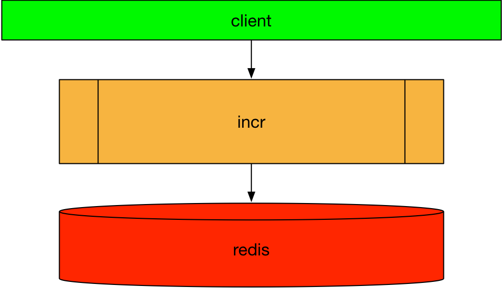

# Speedup to build 
# java images


### **Peter Rossbach**

***
Docker Meetup 11.5.2017 Bochum

---
## Sometimes it feels heavy


-
## Example: java incr



-
## Simple build

* Local install java and mvn at your host
* implement your spring boot app incr
* Package with Dockerfile
* Start with docker-compose


```shell
mvn clean package
docker-compose build
docker-compose up -d
curl http://127.0.0.1:8080/incr
```


-
## Build with separate docker-compose

docker-compose-maven.yml:

```yml
version: '3'
services:
    maven:
      image: maven:3.3-jdk-8-alpine
      working_dir: "/usr/src/mymaven"
      volumes:
        - ./m2:/root/.m2
        - ${PWD}:/usr/src/mymaven
      command: "mvn package"

```

***

one time run...

```shell
docker-compose -f docker-compose-maven.yml run --rm maven
```

-
## Dockerfile

```txt
FROM java:8-jre-alpine
ADD /target/incr-0.0.1-SNAPSHOT.jar app.jar
ENTRYPOINT [ "java", \
             "-Djava.security.egd=file:/dev/./urandom", \
             "-Djedis.pool.host=http://redis:6379", \
             "-jar", "/app.jar" ]
```

-
## docker-compose

```
version: "3"

services:
  incr:
    build: .
    image: 127.0.0.1:5000/bee42/incr
    ports:
       - "8080"
    depends_on:
      - redis
  redis:
    image: redis
    ports:
      - "6379:6379"
```

```shell
$ docker-compose build
$ docker-compose up -d
$ curl http://$(docker-compose port incr 8080)/incr
{"hostname":"c39e543edb0f","name":"access","id":1}
```

-
### Yeah!

* No maven or java local installation need.
* Build with same version at all stages
* Use local maven artefact cache to speed up the build

---
## Use new multi stage build

```txt
FROM maven:3.5-jdk-8 as BUILD

COPY src /usr/src/myapp/src
COPY pom.xml /usr/src/myapp
RUN mvn -f /usr/src/myapp/pom.xml clean package

FROM java:8-jre-alpine
COPY --from=BUILD /usr/src/myapp/target/incr-0.0.1-SNAPSHOT.jar /app.jar
ENTRYPOINT [ "java", \
             "-Djava.security.egd=file:/dev/./urandom", \
             "-Djedis.pool.host=http://redis:6379", \
             "-jar", "/app.jar" ]

```

***

```shell
docker build -f Dockerfile.multistage -t bee42/incr:multi .
```

---
### Dockerfile with FROM Templating

```txt
ARG MAVEN_IMAGE=maven:3.5-jdk-8
ARG JAVA_IMAGE=java:8-jre

FROM ${MAVEN_IMAGE} as BUILD

COPY src /usr/src/myapp/src
COPY pom.xml /usr/src/myapp
RUN mvn -f /usr/src/myapp/pom.xml clean package

FROM ${JAVA_IMAGE}
COPY --from=BUILD /usr/src/myapp/target/incr-0.0.1-SNAPSHOT.jar /app.jar
ENTRYPOINT [ "java", \
             "-Djava.security.egd=file:/dev/./urandom", \
             "-Djedis.pool.host=http://redis:6379", \
             "-jar", "/app.jar" ]
```

***
Available with docker engine version 17.04

-
### Build with other maven oder java runtime versions...

```bash
docker build \
  --build-arg MAVEN_IMAGE=maven:3.3-jdk-8-alpine \
  --build-arg MAVEN_IMAGE=java:jre-8-alpine \
  -f Dockerfile.multistage \
  -t bee42/incr:multi .
```

* Generic way to create image families!
* Build cache works

---
## build with Oracle jre

* Register your account at docker store
  * https://store.docker.com/images/oracle-serverjre-8

```shell
$ docker login -u <username> -p <password> 
$ docker pull store/oracle/serverjre:8
$ docker build \
  --build-arg JAVA_IMAGE=store/oracle/serverjre:8 \
  -f Dockerfile.multistage -t bee42/incr:orcale .
$ docker run --rm --entrypoint java bee42/incr:orcale -version
java version "1.8.0_131"
Java(TM) SE Runtime Environment (build 1.8.0_131-b11)
Java HotSpot(TM) 64-Bit Server VM (build 25.131-b11, mixed mode)
```
***
* Please, check lisence agreement
* __WARNING__: Don`t share or run oracle java images at production!
* http://blog.takipi.com/running-java-on-docker-youre-breaking-the-law/

-
### Fixit!

* Docker CPU limits
  * [JDK-8140793](https://bugs.openjdk.java.net/browse/JDK-8140793)
+ Experimental support for Docker memory limits
  * [JDK-8170888](https://bugs.openjdk.java.net/browse/JDK-8170888)
* Docker memory limits
  * [JDK-8146115](https://bugs.openjdk.java.net/browse/JDK-8146115)

Open JDK Alpine Porting is under development

***
* https://blogs.oracle.com/developers/official-docker-image-for-oracle-java-and-the-openjdk-roadmap-for-containers

-
### Limits:

Cores:

```shell
JAVA_OPTS="-XX:ParallelGCThreads=${core_limit} " \
         "-XX:ConcGCThreads=${core_limit} " \
         "-Djava.util.concurrent.ForkJoinPool.common.parallelism=${core_limit}"
```

New memory setting at java release 8 >=131

```
JAVA_OPTS="-XX:MaxRAM=`cat /sys/fs/cgroup/memory/memory.limit_in_bytes`" 
```

Today with java release 8 lesser than 131 use 50% and set `-Xmx${mx}``

-
### other jvm options

* https://github.com/fabric8io-images/java
* https://hub.docker.com/r/ibmcom/ibmjava/
* https://hub.docker.com/_/openjdk/

---
## Multistage build with goland

Example:

```
cat >main.go <<EOF
package main

import "fmt"

func main() {
	fmt.Println("Hello world!")
}
EOF
```

-
### Dockerfile

```
FROM golang:1.8.1
WORKDIR /go/src/github.com/plutov/golang-multi-stage/
COPY main.go .
RUN GOOS=linux go build -o app .

FROM alpine:latest
RUN apk --no-cache add ca-certificates
WORKDIR /root/
COPY --from=0 /go/src/github.com/plutov/golang-multi-stage/app .
CMD ["./app"]
```

```
$ docker build .
$ docker ps
REPOSITORY          TAG     IMAGE ID            CREATED           SIZE

golang-multi-stage  latest  bcbbf69a9b59        6 minutes ago     6.7MB
```

---
## Q&A


---
## Give the navigator the rudder!


